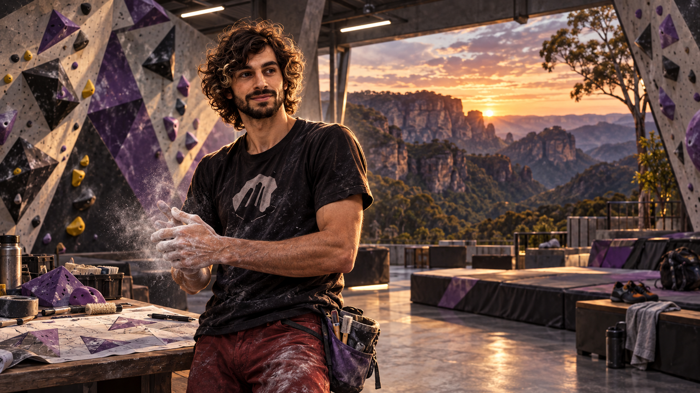

# The Capano Circuit

**CIVILIZATION FIELD GUIDE** · [Cool Wacky Civs](../README.md) · Brave New World + Community Patch

> *Read the sequence. Keep the Project. Earn the SEND.*



| At a glance | Details |
| --- | --- |
| **Leader** | Enrico Capano |
| **Signature system** | Impossible Until It's Possible |
| **Playstyle** | Persistent combat Projects · hill infrastructure · earned techniques |
| **Player access** | Human-only — `Playable = 1`, `AIPlayable = 0` |
| **Requirements** | Civilization V: Brave New World; Community Patch v151 / 5.4.2+ |
| **Supported mode** | New single-player campaign; collection multiplayer/hotseat disabled |

**Explore:** [Signature kit](#signature-kit) · [Mechanics](#mechanics-and-reference) · [Campaign guide](#campaign-guide) · [Worked example](#worked-example) · [Field notes](#field-notes) · [Install](#installation-and-validation) · [Developer reference](#developer-reference)

---

## Civilization identity

The Circuit translates climbing into city development and tactical combat. Terrain becomes a training ground, a difficult opponent becomes a Project, and repeated attempts produce Beta. A completed SEND rewards patience with yields and personal techniques. Veteran units carry that history forward instead of treating every victory as interchangeable.

## Signature kit

**The core loop:** Attempt the same difficult target → build Beta → complete a qualifying SEND → develop permanent technique.

| Element | Replaces / threshold | What it contributes |
| --- | --- | --- |
| Project / Beta | Up to four stacks | Repeated unsuccessful attacks on the same target build +5% attack per stack, up to +20%. |
| SEND | Four-Beta qualifying victory | 25 HP healing, 10 XP, Science/Culture and progress toward permanent techniques. |
| Route Setter | Worker replacement | 3 Movement, ignores Hill movement cost and builds 25% faster while working on Hills. |
| Boulder Sector | Unique improvement | Science/Culture/Production, circuit technology upgrades and once-per-era unit training. |
| Competition Coaching Centre | Armory replacement | +2 Science/Culture and a movement-dependent attack promotion for normally trained land troops. |

Campaign advice explains how to use the implemented mechanics. Numeric worked examples use Standard speed unless stated otherwise. Inherited base-unit and base-building statistics follow the active ruleset.

## Mechanics and reference

### Unique ability — Impossible Until It's Possible

When a Capano land combat unit attacks a unit or city without defeating it, that exact target becomes its Project. The unit gains one stack of Beta, up to four. Its next attacks against that Project receive +5%, +10%, +15%, then +20% attack strength. Attacking a different target abandons the old Project and starts again.

Defeating a Project with four Beta earns a SEND only when the target was at least as strong as the attacker when the Project began. A SEND heals 25 HP, awards 10 XP, and grants equal Science and Culture based on the target's strength and the later combatant era. Cities grant 2.5 times the normal reward. Units trained on a Yellow Circuit grant 15% more.

Each unit's qualifying SEND count unlocks one permanent technique:

- Footwork: +10% defense on Hills.
- Body Position: +10% strength while adjacent to at least two terrain types.
- Coordination: recover one movement point after a kill.
- Commit: +15% attack below 50 HP.
- Complete Climber: +1 Movement, +10% strength, and ignore enemy Zone of Control while on Hills.

The first SEND against a target whose effective strength was at least 1.5 times the attacker's original base strength completes Ammagamma once per player: 500 Science, 500 Culture, and a Golden Age.

### Unique unit — Route Setter

The Route Setter replaces the Worker, inherits its installed Community Patch actions, has 3 Movement, ignores Hill movement cost, and works 25% faster while actively building on a Hill. It can construct the Boulder Sector.

### Unique improvement — Boulder Sector

A Boulder Sector may be built on a land Hill or beside a Mountain, but not adjacent to another Boulder Sector. It starts with +1 Science, +1 Culture, and +1 Production, then progresses through the Circuit:

| Technology | Grade | Additional effect |
| --- | --- | --- |
| Guilds | Red | +1 Production |
| Education | — | +1 Science |
| Architecture | Purple | +1 Culture; enemy penalty becomes -12% |
| Scientific Theory | Black | +1 Science |
| Radio | — | +1 Culture |
| Plastics | Yellow | Units first trained here permanently gain +15% SEND rewards |

Friendly land units pay at most one movement point when entering an owned Sector. Hostile units pay up to one additional movement point and suffer -10% strength until their next turn, increasing to -12% at Architecture.

Once per era, a Capano land combat unit ending its turn on an owned Sector earns 5 XP and Read the Sequence, granting +10% strength in rough terrain for 10 turns. Its first post-Plastics training also marks it Yellow. Enemy first entry can show one of the cosmetic BlocHaus messages, including the rare “ENRICO.”

### Unique building — Competition Coaching Centre

The Competition Coaching Centre replaces and dynamically inherits the current Armory. It adds +2 Science and +2 Culture. Normally produced land combat units trained in its city receive Competition Movement: after moving at least two adjacent tiles during a turn, they gain +15% attack strength for the rest of that turn.

---

## Campaign guide

### Opening — choose good terrain

Survey Hills and Mountain-adjacent tiles for legal Sectors, leaving spacing between them. Route Setters make a hilly core easier to improve. Use ordinary defense while the terrain economy develops; the Project system does not make an exposed early unit invulnerable.

### Middle game — commit to a real Project

Choose a target that is difficult enough to qualify and safe enough to attempt repeatedly. Switching targets abandons the accumulated Beta. Coordinate support fire carefully: if another unit takes the final kill, the Project unit has not completed its own SEND.

### Late game — preserve completed climbers

Keep successful units alive and upgrade them to retain their progress. Train on Sectors in each era, then mark valuable troops Yellow after Plastics. Use Coaching Centre movement before attacking, while avoiding detours that expose units or consume a needed escape route.

## Worked example

A land combat unit attacks one qualifying target four times without defeating it, reaching **four Beta**. Its next attack against that Project has **+20% attack strength**. Defeating the target now can grant a SEND; attacking someone else first abandons that Project. A target weaker than the attacker when the Project began cannot supply the same qualifying SEND.

## Field notes

### Does any four-stack kill grant Ammagamma?

No. Ammagamma is a separate once-per-player achievement requiring the first qualifying SEND against a target whose effective strength was at least 1.5 times the attacker's original base strength.

### Can I place Sectors beside each other?

No. Each must be on a land Hill or beside a Mountain, and cannot be adjacent to another Boulder Sector.

### Does every turn on a Sector award XP?

Training is once per era for each eligible land combat unit, not an unlimited per-turn XP farm.

---

## Installation and validation

This civilization ships with **all twelve civilizations in one Cool Wacky Civs package**. Install and enable the collection once; there is no separate per-civilization mod to enable.

1. Install Civilization V with **Brave New World** and the required **Community Patch**.
2. Put the collection's unpacked mod folder in the game's `MODS` directory, or import its `.civ5mod` package.
3. Enable Community Patch and **one version** of Cool Wacky Civs through the Mods menu.
4. Start a **new single-player game** and choose **The Capano Circuit** for the human player. All collection civilizations are excluded from normal AI selection.

To validate or rebuild from source, run these commands from the **collection root**, one directory above this README:

```powershell
python tools/validate_capano_mod.py
python tools/validate_all.py
python tools/build_mod.py
```

The first command focuses on this civilization; the second checks the complete collection. The builder writes an unpacked folder, ZIP and native LZMA `.civ5mod` under `dist/`, using the current version in [the project](../CoolWackyCivs.civ5proj). If development dependencies are missing, follow the [collection setup instructions](../README.md#build-and-validation).

**Testing boundary:** automated checks cover the database, packaging and applicable Lua behavior. A running Civ V match is still needed to confirm executable timing, combat previews, UI transitions and save/load behavior.

## Developer reference

<details>
<summary><strong>Expand implementation, artwork and detailed validation notes</strong></summary>

Ordinary setup is human-only. Any AI routines described here are retained fallback implementation, rather than permission for Civ V to select this civilization as an AI opponent.

### Implementation and retained AI fallback

Enrico is human-only; the retained AI fallback uses the design's restrained expansion/offense and high Science, Culture, training, defense, recon, and improvement flavors. Community Patch diplomacy hooks add Respect the Send (+10), Abandoned Project (-10), and Strong Climbers (+5) when their stated thresholds are met.

Target identity, Beta, training era, Yellow status, SEND progression, Ammagamma, and diplomacy milestones persist through `Modding.OpenSaveData` or namespaced unit script data. Battle bonuses are temporary target-specific promotions applied only around the Community Patch battle callbacks. Unit-ID reuse is guarded with saved serials, and conversions clear foreign Projects while upgrades preserve same-owner progress.

The improvement uses the stock Fort world model with custom Capano UI art. The Route Setter uses Worker animations. The civilization mark and leader portrait share one atlas to avoid Civ V's stale per-file VFS cache, using legacy DXT5 for block-aligned textures and 32-bit DDS for the 45px row. The generated static leader/loading scene is included; there is no animated 3D leader or custom music. Multiplayer and hotseat are disabled pending synchronization testing.

### Build and validation

From the repository root:

```powershell
python tools/make_capano_assets.py
python tools/validate_capano_mod.py
python tools/build_mod.py
```

The validator applies all SQL to an in-memory copy of the installed game database with current Community Patch schema extensions. It checks exact unit/building inheritance, yields, promotions, localization, project/manifest parity, DDS headers and atlas geometry, VFS import flags, Lua 5.1 syntax, and behavior tests for Projects, SEND/Ammagamma, target switching, Sector placement/movement/training, Competition Movement, and diplomacy modifiers. When Microsoft's DirectXTex `texdiag` is installed, it also independently parses and decodes every DDS payload.

An installed copy can be audited for manifest hashes, VFS flags, and byte-for-byte source parity with:

```powershell
python tools/validate_capano_mod.py --installed-mod "$HOME/Documents/My Games/Sid Meier's Civilization 5/MODS/Cool Wacky Civs (v 17)"
```

The builder creates the one combined Cool Wacky Civs folder, ZIP, and Civ V-compatible `.civ5mod` under `dist/`. Enable it before starting a new game. A final in-game smoke test is still required for setup/Civilopedia icons, combat-preview timing, city capture, save/reload, AI behavior, and world-model visuals.

The supplied design is preserved in [docs/OriginalDesign.md](docs/OriginalDesign.md). Art sources, extraction details, and the generation prompt are recorded in [docs/ART_GENERATION.md](docs/ART_GENERATION.md).

</details>
