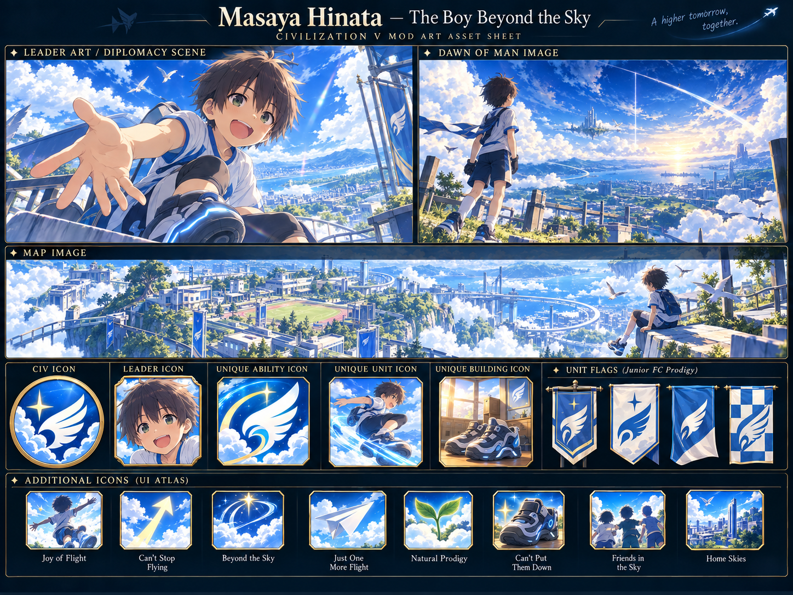

# The Boy Beyond the Sky

**CIVILIZATION FIELD GUIDE** · [Cool Wacky Civs](../README.md) · Brave New World + Community Patch

> *A new horizon, one more flight, and six turns beyond the sky.*



| At a glance | Details |
| --- | --- |
| **Leader** | Masaya Hinata |
| **Signature system** | I'll Be the First to Fly Beyond the Sky |
| **Playstyle** | Exploration · combat participation · promotions · timed mobility bursts |
| **Player access** | Human-only — `Playable = 1`, `AIPlayable = 0` |
| **Requirements** | Civilization V: Brave New World; Community Patch v151 / 5.4.2+ |
| **Supported mode** | New single-player campaign; collection multiplayer/hotseat disabled |


## UA, UU and UBs

**UA** = Unique Ability · **UU** = Unique Unit · **UB** = Unique Building · **UI** = Unique Improvement.

| Type | Name | Replaces / role |
| --- | --- | --- |
| **UA** | **I'll Be the First to Fly Beyond the Sky** | Civilization trait: Joy of Flight and Beyond the Sky |
| **UU** | **Junior FC Prodigy** | Horseman |
| **UB** | **Grav-Shoe Practice Room** | Barracks |

**Explore:** [UA / UU / UBs](#ua-uu-and-ubs) · [Signature kit](#signature-kit) · [Mechanics](#mechanics-and-reference) · [Campaign guide](#campaign-guide) · [Worked example](#worked-example) · [Field notes](#field-notes) · [Install](#installation-and-validation) · [Developer reference](#developer-reference)

---

## Civilization identity

Child Masaya Hinata brings the uncomplicated joy of Flying Circus to an exploration and training civilization. New terrain, experience and legitimate promotions all contribute to Joy of Flight. Its natural cadence is preparation followed by a sudden six-turn burst of freedom, then another climb toward the next horizon.

## Signature kit

**The core loop:** Explore and gain experience → reach 50 Joy → fill 100 → fly for six turns → restart at 25.

| Element | Replaces / threshold | What it contributes |
| --- | --- | --- |
| Joy of Flight | 0–100 meter | Exploration, combat XP, promotions, strong opponents and unique training sources. |
| Can't Stop Flying | 50 Joy | Land military combat XP, Recon/Mounted movement and new-unit training XP. |
| Beyond the Sky | 100 Joy; six player turns | Land military movement, terrain freedom, attack strength, XP and promotion healing. |
| Junior FC Prodigy | Horseman replacement | 12 strength, 5 Movement, movement-after-attack and experience-sensitive combat bonuses. |
| Grav-Shoe Practice Room | Barracks replacement | Inherited training XP, +1 Culture/Science, garrison Joy and a timed movement promotion. |

Campaign advice explains how to use the implemented mechanics. Numeric worked examples use Standard speed unless stated otherwise. Inherited base-unit and base-building statistics follow the active ruleset.

## Mechanics and reference

### Unique ability — I'll Be the First to Fly Beyond the Sky

Joy of Flight ranges from 0 to 100 and is shown in an event-driven top panel for the active Masaya player. It is gained from:

- +1 per revealed tile first recorded around a moving Masaya unit, capped at 5 per player turn.
- +2 the first time each military unit earns combat XP in a player turn.
- +5 for each legitimately selected/earned promotion.
- +3 per Masaya participant when an enemy military unit's effective combat strength is at least as high.
- +10 the first time a unit reaches Level 4.
- the two unique promotion/building sources described below.

At 50 Joy, **Can't Stop Flying** gives all land military units +10% combat XP, Recon and Mounted units +1 Movement, and newly trained military units +5 XP. At 100 Joy, **Beyond the Sky** begins immediately for six player turns: land military units gain +1 Movement, ignore terrain costs, receive +15% attack strength and +50% combat XP, and ignore river-crossing attack penalties. A legitimate promotion during the state heals 25 HP. Joy is locked at its 100 cap until the state ends, then becomes exactly 25.

### Unique unit — Junior FC Prodigy

The Junior FC Prodigy replaces the Horseman, dynamically inherits the installed ruleset's Horseman requirements/companion rows, has 12 Combat Strength and 5 Movement, and rounds 110% of the current Horseman Production cost to the nearest 5 (85 in CP 5.4.2). It:

- ignores terrain movement costs;
- may move after attacking;
- ignores river-crossing attack penalties;
- suffers -33% attack strength against Cities;
- ignores enemy Zone of Control while more than one full Movement point remains.

**Just One More Flight** grants +1 XP after every survived combat, including combat with a city. Its first three lifetime combats also grant +2 Joy each.

**Natural Prodigy** grants +15% Combat Strength during combat against a unit with more XP, plus another +10% if that opponent is at least one level higher. The temporary combat promotions are installed before resolution, removed after resolution, and scrubbed on save load.

### Unique building — Grav-Shoe Practice Room

The Grav-Shoe Practice Room replaces and dynamically inherits the current Barracks. It provides the inherited +15 XP to trained units, +1 Culture, and +1 Science. Each room keeps an independent counter; every third owner turn with a garrison grants +1 Joy. The counter **pauses** while ungarrisoned.

Military units trained there gain **Can't Put Them Down**. For their first ten owner turns they gain +1 Movement; while that timed movement state is active, newly revealed tiles grant +1 XP up to five lifetime exploration XP. Their first legitimate combat-XP gain grants +2 Joy once. The visible tracking promotion remains after the movement effect expires.

---

## Campaign guide

### Opening — follow the horizon

Scout with purpose and uncover terrain through unit movement. Exploration contributes only up to five Joy per player turn, so sending many units into the same already explored area adds little. A Practice Room supplies infrastructure while a garrison gradually contributes its own Joy.

### Middle game — practice without throwing units away

Promotions and survived fights help refill the meter. Junior FC Prodigies reward engagement with more experienced opponents, but their city-attack penalty makes them poor substitutes for siege support. Protect veterans so Level 4 and legitimate promotions become lasting sources of progress.

### Burst window — have a destination ready

Beyond activates immediately at 100; it is not a charge you can hold for later. Watch the meter before earning a promotion or entering combat, then use the six-turn window for a coordinated advance or withdrawal. When Joy resets to 25, resume the exploration and training loop.

## Worked example

At **95 Joy**, an eligible earned promotion supplies **+5**, reaching **100** and starting Beyond the Sky immediately. Joy remains locked at 100 during the six-turn state. When it expires, the meter becomes **25**, so another **25** is needed to regain the 50-Joy threshold and another **75** to trigger the next full burst.

## Field notes

### Do I need to kill units to earn the core combat Joy?

No. The design rewards participation and experience: each military unit's first combat-XP gain in a player turn can pay Joy, subject to its rule.

### Does the Practice Room lose its counter when ungarrisoned?

No. Its independent garrison counter pauses, then resumes when an eligible garrison is present.

### Why did the Prodigy lose Zone-of-Control immunity late in its move?

The conditional immunity requires more than one full Movement point remaining. The implementation refreshes the condition after movement.

---

## Installation and validation

This civilization ships with **all twelve civilizations in one Cool Wacky Civs package**. Install and enable the collection once; there is no separate per-civilization mod to enable.

1. Install Civilization V with **Brave New World** and the required **Community Patch**.
2. Put the collection's unpacked mod folder in the game's `MODS` directory, or import its `.civ5mod` package.
3. Enable Community Patch and **one version** of Cool Wacky Civs through the Mods menu.
4. Start a **new single-player game** and choose **The Boy Beyond the Sky** for the human player. All collection civilizations are excluded from normal AI selection.

To validate or rebuild from source, run these commands from the **collection root**, one directory above this README:

```powershell
python tools/validate_masaya_mod.py
python tools/validate_all.py
python tools/build_mod.py
```

The first command focuses on this civilization; the second checks the complete collection. The builder writes an unpacked folder, ZIP and native LZMA `.civ5mod` under `dist/`, using the current version in [the project](../CoolWackyCivs.civ5proj). If development dependencies are missing, follow the [collection setup instructions](../README.md#build-and-validation).

**Testing boundary:** automated checks cover the database, packaging and applicable Lua behavior. A running Civ V match is still needed to confirm executable timing, combat previews, UI transitions and save/load behavior.

## Developer reference

<details>
<summary><strong>Expand implementation, artwork and detailed validation notes</strong></summary>

Ordinary setup is human-only. Any AI routines described here are retained fallback implementation, rather than permission for Civ V to select this civilization as an AI opponent.

### Persistence and Community Patch hooks

Player Joy, the Beyond end turn, exploration cap, and per-city Practice Room counters use `Modding.OpenSaveData` under `MASAYA_KID_V1_*` keys. A namespaced `[MASAYAKID1:...]` block in each tracked Masaya unit's script data stores a generated serial, Level 4 reward, Prodigy combat count, Practice Room creation turn, exploration XP, one-time combat Joy, and the last turn combat participation paid out. Other mods' script data is preserved.

The runtime uses `BattleStarted`, `BattleJoined`, `BattleFinished`, `UnitSetXY`, `UnitPromoted`, `UnitCreated`, `UnitConverted`, `CityTrained`, and `PlayerDoTurn`. `UnitConverted` is the sole upgrade-state path because CP emits it after `UnitUpgraded` while the old unit still exists. Gameplay has no frame update or rapid timer. The separately loaded UI reads `MapModData` and refreshes only on state/data/active-player events.

### Technical approximations and limits

- Conditional Zone-of-Control immunity is refreshed after each move and at turn/state refresh. It is active only while the Prodigy has more than Civ V's one-move denominator remaining, which is the stable CP approximation of the requested condition.
- “Strong opponent” uses CP's current attack/defense strength wrappers, falling back to base melee/ranged strength if a wrapper is unavailable.
- Exploration remains event-driven: Civ V exposes movement after visibility updates but no tile-revealed hook, so a tile revealed by another source can be credited if its first cache observation occurs around a later Masaya move. The runtime deliberately avoids global-map polling.
- The Prodigy intentionally uses the stock Horseman 3D model and strategic-view silhouette. Its custom 32px wing/star unit flag is separate from its illustrated portrait and remains readable at flag scale.
- The static leader scene has no animation or custom voice/music. Multiplayer and hotseat remain disabled for the combined collection pending synchronization testing; the retained AI fallback is automatic and does not depend on the UI. Ordinary AI selection remains disabled.

### Art

`art-source/MasayaBeyondSky/MasayaConcept.png` is the supplied visual reference. `tools/make_masaya_assets.py` non-destructively crops its authored scenes/icons, creates the required Civ V atlas sizes, and draws only the simplified alpha/flag silhouette. All shipped DDS files, the leader-scene XML, database atlas rows, VFS imports, and package entries are validated.

### Build and validation

From the repository root:

```powershell
python tools/make_masaya_assets.py
python tools/validate_masaya_mod.py
python tools/validate_all.py
python tools/build_mod.py
```

The focused suite checks SQL against the installed CP database, exact inheritance, yields, promotions, localization, art geometry/decoding, project packaging, Lua 5.1 syntax, persistence, thresholds, duration, per-unit caps, combat rewards, training, garrison cadence, and UI visibility.

</details>
