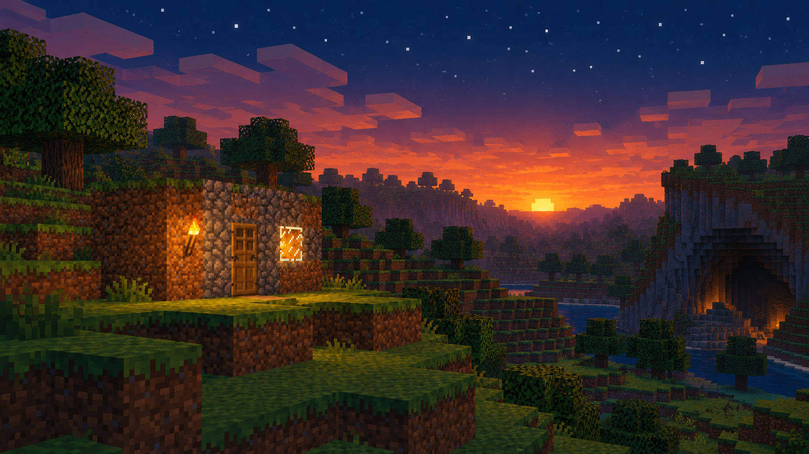

# PaulsoaresJr — The First Night

**CIVILIZATION FIELD GUIDE** · [Cool Wacky Civs](../README.md) · Brave New World + Community Patch

> *The first shelter becomes a memory. The first explorer becomes a veteran.*



| At a glance | Details |
| --- | --- |
| **Leader** | PaulsoaresJr |
| **Signature system** | How to Survive & Thrive |
| **Playstyle** | First experiences · aging Memories · explorer lineages · a lasting Home |
| **Player access** | Human-only — `Playable = 1`, `AIPlayable = 0` |
| **Requirements** | Civilization V: Brave New World; Community Patch v151 / 5.4.2+ |
| **Supported mode** | New single-player campaign; collection multiplayer/hotseat disabled |

## UA, UU and UBs

**UA** = Unique Ability · **UU** = Unique Unit · **UB** = Unique Building · **UI** = Unique Improvement.

| Type | Name | Replaces / role | What it does |
| --- | --- | --- | --- |
| **UA** | **How to Survive & Thrive** | Civilization trait | First-experience Memories and era recall. |
| **UU** | **Survivor** | Scout | A 2-Movement explorer earning XP from ruins, attributed Natural Wonders, its first three non-starting landmasses and First Journey. Has +5 normal healing abroad, a once-per-lifetime Returning Home reward and an Ancient-lineage Modern-era sight/defense bonus. |
| **UB** | **Starter House** | Monument | Provides +2 base Culture and triggers the first-shelter Memory. The original capital's first House anchors Home, which gains +1/+2/+3 Culture and global Happiness at ages 2/4/6 eras. |

**Explore:** [UA / UU / UBs](#ua-uu-and-ubs) · [Signature kit](#signature-kit) · [Mechanics](#mechanics-and-reference) · [Campaign guide](#campaign-guide) · [Worked example](#worked-example) · [Field notes](#field-notes) · [Install](#installation-and-validation) · [Developer reference](#developer-reference)

---

## Civilization identity

A fictional, nostalgic civilization inspired by the patient guide who helped a generation learn to survive its first Minecraft nights. Small first experiences become permanent Memories, a Starter House becomes Home, and an explorer can remain with the player through the ages. Time gives these ordinary beginnings their value.

## Signature kit

**The core loop:** Discover a first experience → preserve its acquisition Era → collect stronger recall in later Eras.

| Element | Replaces / threshold | What it contributes |
| --- | --- | --- |
| Ten Memories | One acquisition each per player | Immediate rewards and later Culture/Science recall according to age. |
| Survivor | Scout replacement | Exploration XP, extra normal healing abroad and persistent same-owner upgrade history. |
| Returning Home | Survivor lifetime reward | After ten consecutive turns abroad, return near the current capital for 15 speed-scaled Culture. |
| Starter House | Monument replacement | +2 base Culture and the first shelter Memory. |
| Home | Original-capital House identity | Culture and global Happiness tiers as its recorded shelter ages. |

Campaign advice explains how to use the implemented mechanics. Numeric worked examples use Standard speed unless stated otherwise. Inherited base-unit and base-building statistics follow the active ruleset.

## Mechanics and reference

### How to Survive & Thrive

Memories are permanent, cannot be spent, and can each be acquired once per player. They record their acquisition era. On entering a later era, each older Memory grants **3 Culture and 3 Science × its age in eras**. Ancient Memories grant 3 of each in Classical, 6 in Medieval, and so on. One consolidated Old Memories notification reports the recall total. Era narratives accompany Classical, Medieval, Renaissance and Industrial; Information concludes with **Do You Remember?**, without an extra arbitrary reward.

| Memory | Trigger | Immediate reward, Standard speed |
| --- | --- | --- |
| The First Shelter | First Starter House, including free buildings | 10 Culture |
| The First Night | First owner turn after the original Capital was founded/observed | 5 Culture, 5 Science |
| The First Danger | First Barbarian killed, attributed by UnitPrekill | 10 Culture |
| The First Mine | Complete a Mine with PlayerBuilt | 10 Science |
| The First Harvest | Complete a valid improvement on a visible bonus/luxury with Food in Resource_YieldChanges | 5 Food in current Capital, 5 Culture |
| The First Journey | Any unit reaches 10 tiles from current Capital | 10 Culture, 10 Science |
| The First Friend | First contact with another major civilization or City-State | 10 Culture |
| The First Wonder | Discover a Natural Wonder | 15 Culture, 10 Science |
| A World Beyond Home | Own at least two cities, founding or acquisition | 15 Culture |
| Something New | Enter Classical after starting the game | 10 Culture, 10 Science |

The journey threshold is `min(10, max(4, floor(min(map width, map height) / 3)))`, keeping it attainable on tiny maps. All instant yields use a single helper with the respective GameSpeed CulturePercent, ResearchPercent and GrowthPercent, rounded to the nearest whole yield. Science goes to current team research, or research overflow if none is selected. XP is not speed-scaled.

### Survivor

Replaces the Scout, copying its active cost, strength, terrain promotions, prerequisites, AI roles, art model and upgrade class from BNW/CP/VP at activation. Movement is 2. Learning the World survives upgrades and grants:

- 5 XP for a ruin bonus when the DLL identifies a surviving discovering unit.
- 10 XP for an attributed Natural Wonder discovery. DLL event variants lacking discovering-player/unit parameters still grant the civilization Memory, but cannot grant unit XP.
- The first three non-starting landmasses discovered by this Survivor lineage grant +10 XP each, for a lifetime maximum of +30 XP. Revisits and water areas never pay. The cap persists through save/reload and legitimate same-owner upgrades.
- 15 XP if this Survivor triggers First Journey.
- +5 additional normal healing in neutral/enemy territory. Native `NeutralHealChange` and `EnemyHealChange` preserve normal movement, embarkation and other healing restrictions. Friendly territory has no extra healing.

A Survivor identified during Ancient that remains in the same player's service from Modern onwards gains **Been Here Since the Beginning**: +1 Sight and +10% Defense. Newly produced later units do not qualify. Same-owner upgrades explicitly preserve identity, landmass history, Ancient qualification and return history.

After ten consecutive owner turns outside your territory, returning within two tiles of the current Capital grants **15 Culture**, speed-scaled, once in that unit's lifetime. Returning to your territory before ten turns resets the trip; completing ten turns preserves its qualification until it returns near the Capital. A unit cannot accumulate multiple trips or redeem on multiple turns. Returning Home remains available to that Survivor's upgraded descendants.

### Starter House and Home

Replaces Monument at its active cost, keeping the Monument building class and companion effects, with exactly +2 base Culture. The first Starter House in the **original Capital** records its era. Home I/II/III add 1/2/3 Culture and global Happiness at ages 2/4/6 eras. Only one hidden dummy tier exists at a time.

Home is anchored to coordinates, original owner and foundation turn. Moving the Palace does not move it. Its bonus requires your ownership and a Starter House; losing the city suspends it, regaining it restores its age, and rebuilding the House never resets that age. Razing destroys Home; a new city on the same tile cannot inherit it. Dummies are hidden, unbuildable, never captured and never supplied to unrelated cities.

### Strategy

Explore naturally, collect different first experiences, keep the original Survivor alive through upgrades, and establish a lasting Home. Avoid rushing through the early game: small early Memories gradually support strong Culture and Science development. Paul favors exploration, growth, friendly trade and defensive preparedness, with low war/deception and wonder competition.

> There will be time for great cities later.
>
> For now, enjoy not knowing what lies beyond the hill.

---

## Campaign guide

### Opening — make the first experiences count

Build the first shelter, explore, improve resources and meet neighbors. Memories earned early have more future Eras in which to age. Keep the Survivor away from fights that risk its lineage for a small immediate reward; the unit can become part of a much longer story.

### Middle game — keep a real Home

Protect the original capital and its Starter House. Relocating the Palace changes where a returning explorer must arrive, but does not move Home. Upgrade surviving explorers with the same owner so their discovery and Ancient-service history remain intact.

### Late game — let the past contribute

Each new Era recalls older Memories at their current ages. Home can reach its older tiers, and an Ancient Survivor lineage qualifies for Been Here Since the Beginning from Modern onward. The Information-era narrative closes the story without adding a separate arbitrary finale reward.

## Worked example

On Standard speed, a single **Ancient Memory** recalls **3 Culture and 3 Science** in Classical, **6 of each** in Medieval and **9 of each** in Renaissance. A Memory first earned in Classical recalls only **3 of each** in Medieval. Acquisition Era matters; all Memories do not share one age.

## Field notes

### Can I spend or reset Memories?

No. Each is permanent and acquired once per player. Repeating its original action does not award it again.

### Does an upgraded Survivor lose its story?

Legitimate same-owner upgrades preserve its lineage. Capture, gifting or ownership transfer permanently strips the personal PSJ history, even between two Paul players.

### What happens if the original capital is lost?

Home pauses while you do not own the city or it lacks the House. Regaining it can restore the original age; razing and refounding cannot inherit it.

---

## Installation and validation

This civilization ships with **all twelve civilizations in one Cool Wacky Civs package**. Install and enable the collection once; there is no separate per-civilization mod to enable.

1. Install Civilization V with **Brave New World** and the required **Community Patch**.
2. Put the collection's unpacked mod folder in the game's `MODS` directory, or import its `.civ5mod` package.
3. Enable Community Patch and **one version** of Cool Wacky Civs through the Mods menu.
4. Start a **new single-player game** and choose **PaulsoaresJr — The First Night** for the human player. All collection civilizations are excluded from normal AI selection.

To validate or rebuild from source, run these commands from the **collection root**, one directory above this README:

```powershell
python tools/validate_psj_mod.py
python tools/validate_all.py
python tools/build_mod.py
```

The first command focuses on this civilization; the second checks the complete collection. The builder writes an unpacked folder, ZIP and native LZMA `.civ5mod` under `dist/`, using the current version in [the project](../CoolWackyCivs.civ5proj). If development dependencies are missing, follow the [collection setup instructions](../README.md#build-and-validation).

**Testing boundary:** automated checks cover the database, packaging and applicable Lua behavior. A running Civ V match is still needed to confirm executable timing, combat previews, UI transitions and save/load behavior.

## Developer reference

<details>
<summary><strong>Expand implementation, artwork and detailed validation notes</strong></summary>

Ordinary setup is human-only. Any AI routines described here are retained fallback implementation, rather than permission for Civ V to select this civilization as an AI opponent.

### Implementation and compatibility

Requires BNW and Community Patch v151 or compatible APIs. Four ordered SQL files register, inherit, specialize and localize the civilization. `Lua/PSJRuntime.lua` is one InGameUIAddin in the collection manifest. Pure SQL/Lua/XML/DDS files are playable without ModBuddy; the project is maintained only to match the collection's existing build pipeline. Run `python tools/build_mod.py` for the deployable folder, ZIP and `.civ5mod` under `dist/`.

Persistent player state uses the repository's `Modding.OpenSaveData()` pattern under `PSJ_V1_*`. Unit state uses a namespaced `[PSJ1:...]` ScriptData segment and save-backed serials rather than reusable engine unit IDs; unrelated ScriptData is preserved. UnitUpgraded snapshots state before conversion, and UnitConverted restores it after native promotion copying. Transferred/captured/gifted Survivors permanently lose their personal PSJ history and custom promotions, including between two Paul players. Reload does not recreate that history; only legitimate same-owner upgrade lineages retain it. Native Survivors must retain Learning the World to establish or bootstrap their history. The appended landmass-count field defaults safely for older seven-field markers. During the existing load-time map pass, migration counts the lineage's saved per-area visits, capped at three, without awarding XP. Identity, Ancient qualification and returning-home state remain intact. New area/count markers are saved before awarding XP. Unit death requires no periodic cleanup of dead engine references.

Gameplay is event-driven with one owner-turn fallback for free buildings, contact, First Night, Home tiers, veteran eligibility and returning explorers. No per-frame timers or polling. A single load-time map scan recognizes already revealed Natural Wonders without inventing unit attribution. Important reward and turn markers are persisted before applying their effects. Logs use `[PSJ]` and only describe acquisitions, era changes, recalls and veteran awards.

Late-era starts establish the current era as the baseline and receive no retroactive Memories, era recall, skipped-era narratives or Ancient veterans. First Night still follows capital founding; advanced/free Starter Houses are recognized on the owner turn. If debug tools skip eras, only the entered era receives its correctly aged recall. No Barbarians, no Ruins and One City Challenge simply leave the corresponding Memories unavailable. Both AI and multiple Paul instances receive independent bonuses; notifications are only shown for the active human player. Gameplay never assumes Player 0.

The **collection** continues to disable multiplayer and hotseat pending synchronization testing of all its civilizations. This runtime avoids UI-dependent gameplay and uses deterministic state, but has not been certified for network multiplayer. The optional Memory panel is deferred; the Civilopedia Memories concept explains every trigger and notifications show rewards.

### DLL event audit

Audited against pinned **Release-5.4.2** and **Release-5.4.6** (the installed CP mod metadata is v151 / 5.4.6), rather than relying on mock argument lists. Both releases agree on the callback ordering below. Lua safely ignores trailing arguments that a callback does not need.

| Hook | Actual arguments | Switch required by PSJ |
| --- | --- | --- |
| PlayerDoTurn | player | None; base hook |
| PlayerCityFounded | player, x, y | None; base hook |
| CityConstructed | player, city, building, gold, faith/culture | None; base construction/purchase hooks; free-building fallback runs on owner turn |
| CityCaptureComplete | oldOwner, capital, x, y, newOwner, population, conquest, greatWorks, capturedGreatWorks | None; base hook |
| PlayerBuilt | player, unit, x, y, build | EVENTS_PLOT |
| UnitPrekill | owner, unit, unitType, x, y, delay, killer | None; identical base fallback |
| TeamSetEra | team, era; optional first flag | None; base two-argument fallback is sufficient |
| TeamMeet | otherTeam, thisTeam | None; base hook |
| NaturalWonderDiscovered | team, feature, x, y, first, discoveringPlayer, discoveringUnit | EVENTS_NW_DISCOVERY, for the unit attribution arguments |
| GoodyHutReceivedBonus | player, unit, goody, x, y | EVENTS_GOODY_CHOICE |
| UnitSetXY | player, unit, x, y | None; base hook |
| UnitCreated | player, unit, unitType, x, y | EVENTS_UNIT_CREATED |
| UnitUpgraded | player, oldUnit, newUnit, goodyUpgrade | None; identical base fallback before conversion |
| UnitConverted | oldOwner, newOwner, oldUnit, newUnit, upgrade | EVENTS_UNIT_CONVERTS |

PSJ therefore enables only **EVENTS_NW_DISCOVERY, EVENTS_GOODY_CHOICE, EVENTS_PLOT, EVENTS_UNIT_CREATED and EVENTS_UNIT_CONVERTS**. It does not switch off any option enabled by another civilization. Its callbacks work with either the base path or an expanded path enabled elsewhere in the collection, independent of SQL load order.

Removed PSJ declarations: EVENTS_BATTLES, EVENTS_DIPLO_MODIFIERS, EVENTS_WAR_AND_PEACE and EVENTS_UNIT_CAPTURE (no matching PSJ callbacks); EVENTS_PLAYER_TURN (controls PlayerDoneTurn, not PlayerDoTurn); EVENTS_TILE_IMPROVEMENTS (different hooks from PlayerBuilt); EVENTS_NEW_ERA, EVENTS_CITY, EVENTS_UNIT_PREKILL and EVENTS_UNIT_UPGRADES (the used arguments already arrive through their base fallback paths). The existing owner-turn fallback continues to recognize free Starter Houses when the expanded city family is off.

Sources: [5.4.2 event definitions](https://github.com/LoneGazebo/Community-Patch-DLL/blob/Release-5.4.2/CvGameCoreDLL_Expansion2/CustomMods.h), [unit dispatch and upgrade/conversion ordering](https://github.com/LoneGazebo/Community-Patch-DLL/blob/Release-5.4.2/CvGameCoreDLL_Expansion2/CvUnit.cpp), [city construction/purchases](https://github.com/LoneGazebo/Community-Patch-DLL/blob/Release-5.4.2/CvGameCoreDLL_Expansion2/CvCity.cpp), [player dispatch and ruin upgrades](https://github.com/LoneGazebo/Community-Patch-DLL/blob/Release-5.4.2/CvGameCoreDLL_Expansion2/CvPlayer.cpp), [team dispatch](https://github.com/LoneGazebo/Community-Patch-DLL/blob/Release-5.4.2/CvGameCoreDLL_Expansion2/CvTeam.cpp), [wonder discovery](https://github.com/LoneGazebo/Community-Patch-DLL/blob/Release-5.4.2/CvGameCoreDLL_Expansion2/CvPlot.cpp); cross-checked with the corresponding [5.4.6 source tree](https://github.com/LoneGazebo/Community-Patch-DLL/tree/Release-5.4.6/CvGameCoreDLL_Expansion2).

UnitUpgraded still fires before `convert()`; UnitConverted fires after native promotion copying and before the old unit is killed. The existing snapshot-before-conversion implementation is retained.

### Art and audio

Finished art is in `Art/`; authored PNGs, reference provenance, prompts and preview are in `art-source/PaulsoaresJr/`. `python tools/make_psj_assets.py` recompiles real DDS files. No DDS headers/payloads are fabricated. DXT5 is used for dimensions divisible by four, legacy RGBA DDS for odd atlas sizes, matching the repository. Circular portraits have gold rims and transparent corners; alpha/flags are white silhouettes without rims.

| Slot | Dimensions / atlas |
| --- | --- |
| Civilization / leader | `PSJIcon{size}.dds`, 2×1 cells, indexes 0/1; sizes 256,128,80,64,48,45,32,24,16 |
| Civilization alpha | `PSJAlpha{size}.dds`, 1×1 at the same sizes |
| Survivor / Starter House / Learning / Beginning | `PSJObjects{size}.dds`, 4×1 indexes 0/1/2/3; sizes 256,128,80,64,45,32,16 |
| Survivor unit flag | `PSJUnitFlag32.dds`, 32×32 |
| Diplomacy / Dawn | `PSJLeader.dds` / `PSJDawn.dds`, 1600×900 |
| Setup map | `PSJMap.dds`, 360×412 |

The Learning torch/book symbol is also suitable for a future UA/Memory panel. The current collection has no separate trait portrait field or PSJ UI to bind it to. Survivor uses the actual Scout 3D model and inherited strategic-view art; the custom flag/portrait distinguish it.

No Paul or Minecraft audio is bundled. Dawn narration is localized text; DawnOfManAudio is empty. Legal base-game America soundtrack references are retained. Custom licensed peace/war tracks and an authorized narration could be supplied later, with audio XML and manifest hooks added then.

### Validation and practical engine test checklist

`python tools/validate_psj_mod.py` checks SQL in a disposable clone of the BNW cache with installed CP schema; every populated Scout/Monument companion table; override/trait registration; yield totals; promotion healing/defense; dummy tiers; localization; duplicate IDs; atlas dimensions and alpha; Lua 5.1 behavior; all ten Memory triggers; replay prevention; era sums; unit upgrades/capture and actual Survivor transfer/reload regression; first-three landmass cap across upgrade/reload and older-marker migration; Home capture/regaining/rebuilding/Palace relocation/refounding; AI; late starts; save-backed context reload; and independent speed channels. `python tools/validate_all.py` additionally checks the whole collection, DDS decoding with DirectXTex, XML, load ordering and existing civ regressions.

Automated mocks are not a running Civ V match. Complete these in-engine smoke tests on a new game with logging enabled:

- **Setup:** choose Paul; check name, trait, both uniques, icons at setup/Civilopedia/production, leader scene, map and Dawn paragraphs. Found Home normally; after the first full turn verify 5 Culture/Science once. Save before and after it, reload, and ensure no duplicate.
- **House:** construct the first House, then another; verify 10 Culture once and Monument policy/class requirements. Test free Monuments, sell/rebuild, capture/regain, relocate Palace, raze/refound.
- **Memories:** independently kill a Barbarian, finish a Mine, improve Wheat/Fish/another valid Food resource, travel the threshold, meet a major and a City-State, reveal a Natural Wonder, found/acquire a second city, and enter Classical. Check exact immediate yields, acquired era in Lua.log, notification and repeat prevention. Save/reload around each.
- **Survivor:** check Scout cost/strength, 2 moves, terrain abilities, ruins, attributed wonders and five non-starting landmasses. Only the first three grant 10 XP each; revisit them and repeat after upgrade/reload to check the 30 XP lifetime cap. Wound it and compare normal stationary healing abroad (+5) with movement/embarkation restrictions. Upgrade it; inspect promotions/history and Lua.log.
- **Return:** spend nine turns abroad and return (no reward); spend ten consecutive turns abroad and return within two tiles of current Capital (15 Culture once). Repeat after upgrade, save/reload and capture; verify no farming.
- **Era aging:** with IGE/debug enter each era; verify ages and one consolidated recall. Nine Ancient Memories yield 27/27 in Classical, plus Something New's 10/10; those nine plus a Classical Memory yield 57/57 in Medieval. Check all Home tiers and no stacking.
- **Modern:** preserve an Ancient Survivor and its upgrade; compare a later-built Survivor. Only the Ancient lineage gains +1 Sight/+10% Defense. Check capture/gifting of an actual Survivor between different Paul players, save/reload, advance its new owner to Modern and upgrade it; identity and both PSJ promotions must remain absent. Compare a native Survivor through the same sequence to verify legitimate history survives. Also load an older seven-field unit record and verify previous landmass visits count toward the cap.
- **Information:** see Do You Remember? once, followed by ordinary recall, without extra finale yields. Reload before/after the transition.
- **Edge settings:** tiny map, Classical/Modern/Information start, advanced start, no Barbarians, no Ruins, OCC, pre-revealed Natural Wonder, multiple Paul players, and AI observer/autoplay. Compare Quick/Standard/Epic/Marathon reward scaling.
- **Long game:** review Lua.log, database.log and xml.log through several eras; verify AI gains bonuses and no missing art, SQL failures or nil-reference crashes. Network/hotseat testing must precede enabling those collection flags.

</details>
