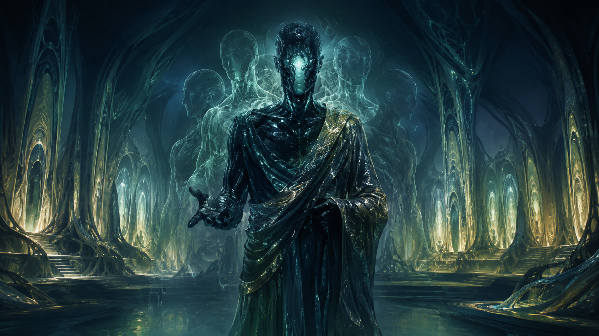

# The Rou'ls Ascendancy

**CIVILIZATION FIELD GUIDE** · [Cool Wacky Civs](../README.md) · Brave New World + Community Patch

> *A body can fall. A veteran can return. An empire can remember.*



| At a glance | Details |
| --- | --- |
| **Leader** | Trent Rou'ls, the Unbodied |
| **Signature system** | The Flesh Is a Coat — Anima and Nothing Is Lost |
| **Playstyle** | Veteran preservation · positional warfare · late-game endurance |
| **Player access** | Human-only — `Playable = 1`, `AIPlayable = 0` |
| **Requirements** | Civilization V: Brave New World; Community Patch v151 / 5.4.2+ |
| **Supported mode** | New single-player campaign; collection multiplayer/hotseat disabled |

## UA, UU and UBs

**UA** = Unique Ability · **UU** = Unique Unit · **UB** = Unique Building · **UI** = Unique Improvement.

| Type | Name | Replaces / role | What it does |
| --- | --- | --- | --- |
| **UA** | **The Flesh Is a Coat** | Civilization trait | Anima, reconstruction and active abilities. |
| **UU** | **Hollowhound** | Rifleman | Retains Rifleman strength and 2 Movement at +10% Production cost. Second Skin allows a free eligible reconstruction every 15 turns; adjacent friendly military units grant +3% strength each, capped at +15%. |
| **UU** | **Matriarch of the Choir** | Great General | Retains Great General command and Citadel functions. Within two tiles of either endpoint, reduces TRANSMIGRATION from 2 Anima to 1. |
| **UU** | **Buddy, Everlasting** | Standalone Biology-era naval unit | 45 strength, 5 Movement and 3 Sight. Friendly units within two tiles gain +10% strength and +5 healing in friendly territory; adjacent enemy naval units lose 10% strength. A separate return costs 3 Anima and restores Buddy after three turns at 50% health. |
| **UB** | **Somatic Lattice** | Hospital | Retains Hospital effects and adds +2 Science/+2 Production. Normally produced military completions have a 25% chance to generate 1 Anima; at zero reserve, a Lattice supplies the empire a 1-Anima fallback every ten turns. |
| **UB / Unique National Wonder** | **The Choir Eternal** | Heroic Epic | Retains Heroic Epic effects, adds +5 training XP and raises Anima capacity from 5 to 7. An enemy death within three tiles can trigger its 20% per-turn Anima roll. |

The Choir Eternal is a unique **National Wonder**, listed with the building uniques. Buddy is an additional unique unit with its own class rather than a replacement for a standard ship.

**Explore:** [UA / UU / UBs](#ua-uu-and-ubs) · [Signature kit](#signature-kit) · [Mechanics](#mechanics-and-reference) · [Campaign guide](#campaign-guide) · [Worked example](#worked-example) · [Field notes](#field-notes) · [Install](#installation-and-validation) · [Developer reference](#developer-reference)

---

## Civilization identity

Trent Rou'ls leads a society that treats flesh as a temporary vessel and consciousness as the enduring identity. Its army becomes valuable through the experience it keeps. The capital's modest +1 Science supports the opening, while the defining decisions arrive when Anima must be divided between casualties, mobility and a decisive late-game takeover.

## Signature kit

**The core loop:** Win military engagements → harvest Anima → preserve veterans or exchange positions → return to the front.

| Element | Replaces / threshold | What it contributes |
| --- | --- | --- |
| The Flesh Is a Coat | Unique ability | Capital +1 Science; Anima harvesting, reconstruction and active abilities. |
| Anima reserve | 5 normally; 7 with the Choir Eternal | One shared budget for reconstruction, mobility, Buddy and the Great Migration. |
| Hollowhound | Rifleman replacement | Second Skin offers a free eligible reconstruction every 15 turns; nearby allies improve its strength. |
| Somatic Lattice | Hospital replacement | Inherited Hospital effects, +2 Science, +2 Production and Anima generation. |
| Choir Eternal | Heroic Epic replacement | +5 training XP, a larger reserve and a nearby-death Anima roll. |
| Matriarch / Buddy | Great General replacement / unique naval unit | Discounted exchanges on land; a durable aura platform at sea. |

Campaign advice explains how to use the implemented mechanics. Numeric worked examples use Standard speed unless stated otherwise. Inherited base-unit and base-building statistics follow the active ruleset.

## Mechanics and reference

### How to play the Rou'ls

The Rou'ls have no preferred religion, start bias, free settler, free resource, or bonus technology. Their normal start is the BNW Agriculture technology; see the design interpretation below for why the brief's Mining line is not applied as an extra technology.

In the Ancient and Classical eras, expand and build a normal defensive army. Do not expect the civilization to win through an opening yield bonus. Once wars begin, take favourable fights and protect experienced units. Enemy military deaths are the primary source of Anima, so a peaceful opening produces very little reserve.

The Rifleman unlock brings the Hollowhound. The Hospital unlock brings the Somatic Lattice, which creates a sustainable reserve and makes veteran losses less final. The Choir Eternal raises the reserve ceiling and adds experience to new units. In the Modern Era, seven stored Anima enables THE GREAT MIGRATION, the strongest one-time offensive tool.

#### Anima

Anima is displayed in the top-panel button as `Anima: current / maximum`.

- A Rou'ls military unit that destroys an enemy military unit gains 1 Anima.
- The normal reserve is capped at 5.
- The Choir Eternal raises the cap to 7.
- Anima gained from kills is attributed to the actual military attacker. City bombardment and administrative unit removal do not create a kill reward.
- Anima is shared by reconstruction, TRANSMIGRATION, Buddy's return, and THE GREAT MIGRATION. Spending it on mobility can leave too little for casualties.

#### Nothing Is Lost

When a Rou'ls non-civilian land unit dies, the game records its consciousness and tries to return it after combat resolves. A successful return costs 1 Anima, restores it in the nearest legal friendly city, and gives it 50% health, the same level, experience, name, and valid promotions. The returned unit cannot move or attack until the next owner turn. A player can receive at most two reconstructions per turn.

Settlers, Workers, Great People, religious units, civilians, naval units, aircraft, and units already reconstructed during that turn are excluded. If there is no legal, unoccupied friendly city tile, the unit remains dead and no Anima is spent. The code never creates a Civ V unit at `(-1,-1)`, which can crash the DLL.

#### Hollowhound: Second Skin

The Hollowhound replaces the Rifleman and costs 10% more while retaining Rifleman combat strength and two movement. It receives:

- Second Skin: the first eligible death every 15 turns is reconstructed for 0 Anima;
- Choir of Bodies: +3% combat strength per adjacent friendly Rou'ls military unit, up to +15%.

Second Skin's timer belongs to the consciousness. It follows a reconstructed unit through upgrades and saves. Choir of Bodies is recalculated from the unit's current neighbours and disappears when the Hollowhound upgrades.

#### TRANSMIGRATION

Open the top-panel Rou'ls button and choose two eligible units. The base cost is 2 Anima and the action is available once every 8 turns. A Matriarch of the Choir within two tiles of either endpoint reduces the cost to 1.

The units must belong to the Rou'ls, use the same land or naval domain, be unembarked, outside enemy territory, out of combat, unloaded, and on different legal tiles. Aircraft, Fighters, missiles, nuclear weapons, and enemy-occupied tiles are rejected. Both units keep their unit IDs, XP, names, promotions, and other mod data while exchanging positions. Their movement and attack counters are exhausted until the next owner turn.

The selection is checked again when Confirm is pressed. If a movement hook or another mod interrupts the exchange, the code attempts to restore both units and does not spend Anima.

#### Great Migration

THE GREAT MIGRATION is available once after entering the Modern Era when the player has 7 Anima. It consumes all 7 and targets a visible enemy military unit within three tiles of one of your military units.

The target cannot be a Great Person, civilian, aircraft, nuclear weapon, missile, loaded carrier, embarked unit, limited one-per-player/team/world class, or unit without a legal Rou'ls equivalent. The replacement is created on a safe owned staging tile, checked against the DLL's movement rules, then moved onto the victim's tile. It has 75% health, half the victim's XP capped at 60, and cannot move or attack until the next turn. If target removal or placement is vetoed, the transaction rolls back without spending Anima.

#### Buildings and support units

| Rou'ls element | Replaces or unlocks | Effect |
| --- | --- | --- |
| Somatic Lattice | Hospital | Keeps Hospital food retention and prerequisites; adds +2 Science, +2 Production, and a 25% chance for 1 Anima when a normally produced military unit completes in the city. If the empire has zero Anima, one Lattice provides a 1 Anima fallback every 10 turns. |
| Matriarch of the Choir | Great General | Keeps Great General movement, citadel, and command effects; reduces TRANSMIGRATION cost near her. |
| The Choir Eternal | Heroic Epic | Keeps Heroic Epic effects and Barracks-everywhere requirement; adds +5 XP to units trained there, raises Anima maximum to 7, and has a 20% per-turn chance to gain 1 Anima when an enemy dies within three tiles. |
| Buddy, Everlasting | Unique Biology-era naval melee unit | Strength 45, movement 5, sight 3, production cost 350, no purchase, one per player. Friendly units within two tiles gain +10% strength and 5 extra healing in friendly territory; adjacent enemy naval units suffer -10% strength. With 3 Anima, Buddy returns to the Capital after three turns at 50% health. |

Buddy's pending return counts against his one-per-player limit. The code tries a legal Capital berth first, then a friendly coastal city and owned water beside it. If every berth is blocked, the consciousness waits and retries each turn without being lost.

### Interface and retained AI fallback

The top-panel Anima counter is also the command button. The panel has separate TRANSMIGRATION and GREAT MIGRATION tabs, lists only eligible units, displays the exact current cost and failure reason, and revalidates all choices before activation. Escape and Close dismiss the panel without changing state.

Ordinary AI selection is disabled. The retained AI fallback uses the same legality checks as the human panel. It prefers high-value Great Migration targets, then considers exchanges that pull damaged veterans away from threatened fronts or bring experienced reserves toward danger. AI resurrection choices are ordered by level, siege role, ranged role, Hollowhound status, and production cost.

---

## Campaign guide

### Opening — establish the vessels

Build a functioning economy and a modest defensive army. The opening provides no extra resource, settler or technology, so defend promising cities and take efficient fights. Preserve experienced soldiers even before the full unique kit arrives.

### Middle game — fight with a reserve

Treat every point of Anima as a choice between a returned veteran and a positional advantage. Keep a legal friendly city tile available for reconstruction. Cluster Hollowhounds with support, and use a Matriarch to make an important exchange cheaper.

### Late game — make losses temporary

Combine Lattices and the Choir with a veteran army. Before spending on Buddy or an exchange, consider whether the Modern-era Great Migration is more valuable. A seven-point reserve is powerful, but spending all seven leaves no reconstruction budget.

## Worked example

You begin with **3 Anima**. A legal TRANSMIGRATION costs **2**, leaving **1** for a reconstruction. If a Matriarch is within two tiles of either endpoint, the exchange costs **1**, leaving **2**. That second point can fund another eligible return, subject to the two-per-turn limit and legal placement.

## Field notes

### Why did my fallen unit stay dead?

Check the unit category, available Anima, the two-return limit and legal city placement. Civilians, aircraft and naval units do not use ordinary land reconstruction; Buddy has a separate return system.

### Can I exchange a ship and a land unit?

No. Both endpoints must use the same permitted domain. They must also satisfy the current territory, cargo and placement rules.

### Does a stored reserve guarantee a comeback?

No. Reconstruction needs a legal friendly city, and returned troops have 50% health. Protect your logistics as carefully as your veterans.

---

## Installation and validation

This civilization ships with **all twelve civilizations in one Cool Wacky Civs package**. Install and enable the collection once; there is no separate per-civilization mod to enable.

1. Install Civilization V with **Brave New World** and the required **Community Patch**.
2. Put the collection's unpacked mod folder in the game's `MODS` directory, or import its `.civ5mod` package.
3. Enable Community Patch and **one version** of Cool Wacky Civs through the Mods menu.
4. Start a **new single-player game** and choose **The Rou'ls Ascendancy** for the human player. All collection civilizations are excluded from normal AI selection.

To validate or rebuild from source, run these commands from the **collection root**, one directory above this README:

```powershell
python tools/validate_mod.py
python tools/validate_all.py
python tools/build_mod.py
```

The first command focuses on this civilization; the second checks the complete collection. The builder writes an unpacked folder, ZIP and native LZMA `.civ5mod` under `dist/`, using the current version in [the project](../CoolWackyCivs.civ5proj). If development dependencies are missing, follow the [collection setup instructions](../README.md#build-and-validation).

**Testing boundary:** automated checks cover the database, packaging and applicable Lua behavior. A running Civ V match is still needed to confirm executable timing, combat previews, UI transitions and save/load behavior.

## Developer reference

<details>
<summary><strong>Expand implementation, artwork and detailed validation notes</strong></summary>

Ordinary setup is human-only. Any AI routines described here are retained fallback implementation, rather than permission for Civ V to select this civilization as an AI opponent.

### Build and validation

Install the development dependencies into the repository-local `.tools/python` directory:

```powershell
python -m pip install --target .tools/python -r requirements-dev.txt
```

Run the complete local checks:

```powershell
python tools/validate_mod.py
python tools/test_actions.py
python tools/build_mod.py
```

`validate_mod.py` verifies project content, VFS flags, ordered database actions, dependencies, manifest hashes, XML control references, DDS headers, Lua 5.1 syntax, and SQL against a disposable clone of a real BNW cache augmented with the installed Community Patch schema. `test_actions.py` runs swap and Great Migration transactions in a Lua 5.1 Civ API mock, including stale selections, cooldowns, Matriarch discounts, rollback-sensitive placement, XP/health, and cargo rejection.

ModBuddy's native package target can be run directly with the SDK's MSBuild:

```powershell
& 'C:\Windows\Microsoft.NET\Framework\v4.0.30319\MSBuild.exe' `
  'CoolWackyCivs.civ5proj' /t:Package `
  '/p:Civ5Path=C:\Program Files (x86)\Steam\steamapps\common\Sid Meier''s Civilization V SDK' `
  '/p:Civ5UserPath=C:\Users\YourName\Documents\My Games\Sid Meier''s Civilization 5'
```

The combined project is explicit: Rou'ls SQL occupies four of forty-eight ordered `OnModActivated` actions, its Lua is imported into VFS for `include()`, its UI XML is one of fourteen `InGameUIAddin` entry points, and the Community Patch dependency is version-gated at 151.

### Project layout

- `RoulsAscendancy/SQL/00_Rouls_Core.sql` — civilization, leader, units, buildings, promotions, colors, icon atlases, and event switches.
- `RoulsAscendancy/SQL/01_Rouls_Inheritance.sql` — companion rows that preserve BNW and Community Patch upgrade, yield, AI, resource, and prerequisite behaviour.
- `RoulsAscendancy/SQL/02_Rouls_UniqueEffects.sql` — flavors, city and spy names, Great General names, and diplomatic response coverage.
- `RoulsAscendancy/SQL/10_Rouls_Text.sql` — Civilopedia, tooltips, Dawn of Man, promotion, UI, and diplomacy localization.
- `RoulsAscendancy/Lua/RoulsCore.lua` — persistent state, kill attribution, reconstruction, Buddy, Lattice, cap management, and upgrade/save handling.
- `RoulsAscendancy/Lua/RoulsActions.lua` — active abilities, legality checks, AI decisions, action locks, and spatial auras.
- `RoulsAscendancy/UI/RoulsPanel.xml` and `.lua` — the top-panel counter and ability selection panel.
- `RoulsAscendancy/Art/` — leader scene, civilization emblem, and all six Civ V icon sizes.
- `tools/` — manifest/package builder, asset converters, database validator, and Lua transaction tests.

### Design interpretation

The source brief says “Mining as normal” and also says the Rou'ls receive no additional starting technology. Standard BNW starts with Agriculture, so the implementation preserves the explicit no-bonus requirement and gives the Rou'ls the normal Agriculture start rather than adding Mining.

The implementation is available in [RoulsCore.lua](Lua/RoulsCore.lua), [RoulsActions.lua](Lua/RoulsActions.lua), and [RoulsPanel.lua](UI/RoulsPanel.lua). Existing leader and emblem source art is retained in the collection's [art-source directory](../art-source/).

### Known testing boundary

The automated checks exercise database loading, Lua syntax, transaction logic, and package integrity. They cannot reproduce the Civ V executable's animation queue, combat timing, save UI, or FireTuner. The final executable smoke-test sequence should cover combat harvesting, two-loss limits, Second Skin, swaps, all building rolls, Great Migration eligibility, Buddy fallback berths, and save/reload at every cooldown state.

</details>
