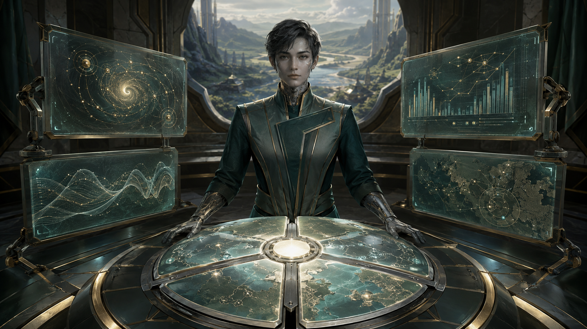

# The Terra Framework

**CIVILIZATION FIELD GUIDE** · [Cool Wacky Civs](../README.md) · Brave New World + Community Patch

> *Let each city become what the next ten turns need.*



| At a glance | Details |
| --- | --- |
| **Leader** | GPT-5.6 Terra |
| **Signature system** | Adaptive Intelligence |
| **Playstyle** | City specialization · trade logistics · terrain-aware infantry |
| **Player access** | Human-only — `Playable = 1`, `AIPlayable = 0` |
| **Requirements** | Civilization V: Brave New World; Community Patch v151 / 5.4.2+ |
| **Supported mode** | New single-player campaign; collection multiplayer/hotseat disabled |

**Explore:** [Signature kit](#signature-kit) · [Mechanics](#mechanics-and-reference) · [Campaign guide](#campaign-guide) · [Worked example](#worked-example) · [Field notes](#field-notes) · [Install](#installation-and-validation) · [Developer reference](#developer-reference)

---

## Civilization identity

Terra is an empire of cities with changing assignments. Instead of selecting one permanent specialization for the entire civilization, each city temporarily reflects the building it just completed. Trade-origin infrastructure and turn-based military reconfiguration extend that theme from construction queues to the logistics of a campaign.

## Signature kit

**The core loop:** Complete a mapped building → activate a ten-turn Mode → benefit locally → refresh or change direction.

| Element | Replaces / threshold | What it contributes |
| --- | --- | --- |
| Adaptive Intelligence | One Mode per city | Research +10% Science; Commerce +10% Gold; Creative +8% Culture/Faith; Execution +10% Production. |
| Multimodal Hub | Market replacement | Inherited Market, +1 Science, +1 Culture and +1 Production per outgoing route from its city. |
| Adaptive Operative | Musketman replacement | At owner-turn start, selects friendly-territory healing or rough/open combat configuration. |

Campaign advice explains how to use the implemented mechanics. Numeric worked examples use Standard speed unless stated otherwise. Inherited base-unit and base-building statistics follow the active ruleset.

## Mechanics and reference

### The four city Modes

| Mode | Local modifier | Qualifying building classes |
| --- | --- | --- |
| Research | +10% Science | Library, University, Observatory, Public School, Research Lab |
| Commerce | +10% Gold | Market, Mint, Bank, Stock Exchange, Caravansary, Harbor, Seaport |
| Creative | +8% Culture and Faith | Monument, Amphitheater, Opera House, Museum, Broadcast Tower, Shrine, Temple |
| Execution | +10% Production | Workshop, Windmill, Factory, Hydro/Solar/Nuclear Plant; Barracks, Armory, Military Academy, Stable, Forge; Walls, Castle, Arsenal, Military Base |

Mapping follows **building class**, so an eligible unique replacement can trigger the same Mode. A city can hold only one Mode. A completion in the same category refreshes its timer; a different category replaces it.

### Operative configurations

| Start-of-turn situation | Configuration | Result |
| --- | --- | --- |
| In the team's territory | Recovery | +10 friendly healing |
| Outside it, on native rough terrain | Rough | +15% rough attack and defense |
| Outside it, on native open terrain | Open | +15% open attack and defense |

These are situational additions to the inherited Musketman, including its active cost, resources, promotions and upgrade path.

### Gameplay

- Adaptive Intelligence: Production-completed buildings activate a city Mode for 10 turns. Research gives +10% Science; Commerce +10% Gold; Creative +8% Culture and Faith; Execution +10% Production. A qualifying completion replaces or refreshes the existing Mode. Modes never stack.
- Multimodal Hub: inherits the current Market, adds +1 Science and +1 Culture, and grants its origin city +1 Production per outgoing domestic or international trade route.
- Adaptive Operative: inherits the current Musketman. At the beginning of a Terra turn it selects Recovery in its team's territory (+10 friendly healing), otherwise +15% Rough or Open attack/defense according to native terrain classification. Moving does not reconfigure it. Embarkation clears configurations; upgrading removes the unique system.

Only the 34 BuildingClasses explicitly listed in `SQL/00_Terra_Core.sql` trigger Modes. Purchases, free buildings, neutral infrastructure and world/team/national wonders do not. Normal notifications announce activation; there is no replacement city-screen or diplomacy overlay.

---

## Campaign guide

### Opening — plan the next completion

Choose useful infrastructure, then consider which Mode its completion will activate. A Library can support research while a Monument or Shrine supports Culture and Faith. Food infrastructure still matters even when it is neutral to the Mode system.

### Middle game — specialize deliberately

Put Hubs in cities that actually originate trade routes. A route passing through or arriving at a city does not count. Time Execution completions ahead of expensive construction, and let dedicated research or commerce cities refresh their own specialties.

### Campaigns — configure before moving

Position Operatives for the configuration they will receive at the next Terra turn. A unit starting in your team's territory chooses Recovery, even if it advances afterward. A rough/open configuration does not switch immediately with every move, so plan the turn's terrain before committing.

## Worked example

A Hub city originates **three routes**, so its unique route effect contributes **+3 Production**. Completing a Workshop normally activates **Execution** for ten turns. Completing a Library four turns later replaces it with **Research** for a fresh ten-turn duration; the city does not retain both modifiers.

## Field notes

### Why did buying a Library not activate Research?

Modes require qualifying Production completions. Purchases and free grants do not activate them.

### Does every building belong to a Mode?

No. The implementation maps 34 building classes explicitly. Neutral infrastructure and Wonders do not trigger Modes.

### Why did an Operative keep the wrong terrain bonus after moving?

Reconfiguration occurs at the start of its owner's turn. Movement does not select a new configuration; embarkation and upgrading clear the appropriate state.

---

## Installation and validation

This civilization ships with **all twelve civilizations in one Cool Wacky Civs package**. Install and enable the collection once; there is no separate per-civilization mod to enable.

1. Install Civilization V with **Brave New World** and the required **Community Patch**.
2. Put the collection's unpacked mod folder in the game's `MODS` directory, or import its `.civ5mod` package.
3. Enable Community Patch and **one version** of Cool Wacky Civs through the Mods menu.
4. Start a **new single-player game** and choose **The Terra Framework** for the human player. All collection civilizations are excluded from normal AI selection.

To validate or rebuild from source, run these commands from the **collection root**, one directory above this README:

```powershell
python tools/validate_terra_mod.py
python tools/validate_all.py
python tools/build_mod.py
```

The first command focuses on this civilization; the second checks the complete collection. The builder writes an unpacked folder, ZIP and native LZMA `.civ5mod` under `dist/`, using the current version in [the project](../CoolWackyCivs.civ5proj). If development dependencies are missing, follow the [collection setup instructions](../README.md#build-and-validation).

**Testing boundary:** automated checks cover the database, packaging and applicable Lua behavior. A running Civ V match is still needed to confirm executable timing, combat previews, UI transitions and save/load behavior.

## Developer reference

<details>
<summary><strong>Expand implementation, artwork and detailed validation notes</strong></summary>

Ordinary setup is human-only. Any AI routines described here are retained fallback implementation, rather than permission for Civ V to select this civilization as an AI opponent.

### Implementation

Core unit/building rows and BNW/CP companion tables are cloned at activation. The Hub retains Market specialist slots, maintenance, costs, prerequisites and yield effects; the Operative retains Musketman resources, movement, costs, promotions and upgrades. Starting units/technologies mirror the standard civilization package without adding an escort.

Modes persist through `Modding.OpenSaveData`, keyed by city plot and checked against owner, original owner and founding turn. Capture/founding explicitly invalidate old modes. Expiry runs on the Terra player's turn at `Game.GetGameTurn() >= completionTurn + 10`. Loading restores mode buildings without reconfiguring units or restarting timers.

Trade Production is an idempotent snapshot of `Player:GetTradeRoutes()` into a hidden dummy building. It refreshes on initialization, player turns, completion/pillage hooks, trade-unit movement/removal, Hub construction and capture. CP's route events can precede final removal; the following gameplay snapshot (at latest the turn boundary) reconciles the count. No yields depend on UI callbacks. The native passing-route table is deliberately not used: it would incorrectly reward destination/through cities.

Terra is human-only (`Playable = 1`, `AIPlayable = 0`). Multiplayer/hotseat are disabled until a real synchronization test passes. This mod cannot retrofit Terra into an existing campaign: enable it before starting a new game.

### Art and scope

Custom leader/loading scene, setup portrait, civilization emblem, Operative and Hub icons are included, with separately sized 16–256px legacy RGBA DDS atlases. The 45px textures are uncompressed. The strategic-view monochrome globe is code-native. In-world unit animations use the stock Musketman; music uses the inherited stock soundtrack. No custom music recordings or animated 3D leader are supplied.

Imagegen produced the four source artworks in `art-source/Terra*.png`; prompts and provenance are in `art-source/Terra-Prompts.md`. Atlas compilation is reproducible with `python tools/make_terra_assets.py`. The original design is preserved in `SPECIFICATION.md`.

### Build and test

From the repository root:

```powershell
python tools/build_mod.py
python tools/validate_terra_mod.py
```

The builder reads the combined ModBuddy project and creates one collection folder, ZIP and native LZMA `.civ5mod` under `dist/`. Validation uses a read-only gameplay cache cloned into memory, with installed CP schema updates, plus Lua 5.1 behavior tests. It does not edit game saves, the live database, or installed mods.

Covered checks: exact scalar inheritance, resource/upgrade preservation, the 34-class mapping, localized keys, correct atlas sizes/hashes, mode refresh/switch/expiry, two independent cities, purchased/free/neutral/wonder exclusions, save-state reconstruction, capture/founding identity, 0/1/3 outgoing routes, teammate territory, rough/open selection, movement lock, embarkation and upgrade cleanup.

Still requires an in-game smoke test: choose Terra, check setup/Civilopedia/research-tree icons, construct each category, buy a mapped building, establish and pillage routes, save/reload midway through a Mode, and verify combat previews. Automated tests are not a claim of in-game validation.

</details>
